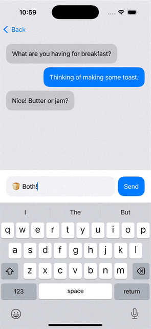
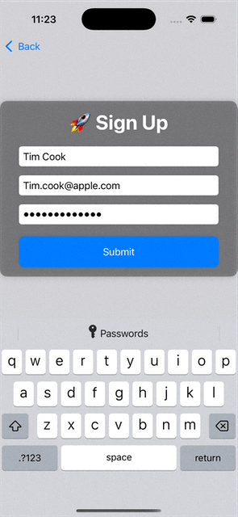
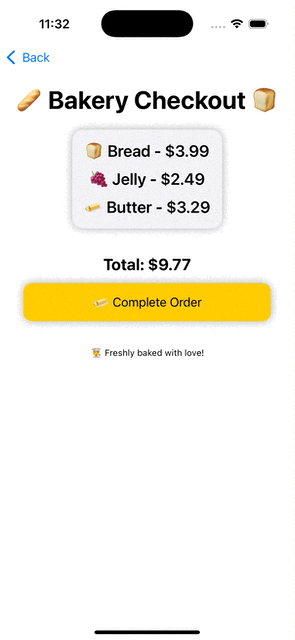

# ToastWindow

[](https://github.com/apple/swift-package-manager)
[](https://developer.apple.com/ios/)
[](https://developer.apple.com/macos/)
[](https://swift.org)

A lightweight SwiftUI package for displaying toast notifications in iOS applications. ToastWindow creates a secondary window to display toast notifications, ensuring they appear above all other content while maintaining a clean and modern look using any SwiftUI view you pass in.


### Control your toasts entirely with SwiftUI (see demo project)

| **Top Toast**  | **Middle Toast**  | **Bottom Toast**  |
|---------------|-----------------|-----------------|
|  |  |  |


## Features

- 🪽 **SwiftUI Toast Views**
- 🖌️ Fully customizable using **SwiftUI Modifiers**
    - 🖼️ **Icons & Images** – Enables adding symbols or images in the toast message
    - 🎨 **Themes & Styling** – Allows color, typography, shadow, and rounded corner customization
    - 🎭 **Customizable Animations** – Build animations using SwiftUI Modifiers
    - ✋ **Gesture Handling** – Enable **touch and swipe** gestures, such as dismissing by tap or swipe
    - 📌 **Positioning Control** - Use SwiftUI to position your content
    - 🔄 **Device Rotation** - Position will update when the device rotates
- 🔝 **Displays on top of everything** including sheets from the `.sheet` SwiftUI modifier
- 🔄 **Built-in Window management** - Prevent memory leaks
- 🔒 **Thread Safety** - Ensures UI updates occur on the main thread
- ⏱️ **Customizable Duration** - Be sure to include animation duration in duration passed to `.showToast()`
------

## Installation

### Swift Package Manager

Add the following dependency to your `Package.swift` file:

```swift
dependencies: [
    .package(url: "https://github.com/michael94ellis/ToastWindow.git", from: "1.0.0")
]
```

Or add it directly in Xcode:

1. Go to File > Add Packages...
2. Enter the repository URL below and then click Add Package

```
https://github.com/michael94ellis/ToastWindow.git
```

------

## Usage

### Basic Usage

```swift
import SwiftUI
import ToastWindow

struct ContentView: View {
    @Environment(\.toastManager) private var toastManager
    
    var body: some View {
        Button("Show Toast") {
            toastManager.showToast(
                content: Text("Hello, World!")
                    .padding()
                    .background(Color.blue)
                    .foregroundColor(.white)
                    .cornerRadius(10),
                duration: 2.0
            )
        }
    }
}
```

### Custom Toast Content

```swift
struct SuccessToast: View {
    
    @State private var isVisible = false
    
    var body: some View {
        Text("Account Created Successfully")
            .multilineTextAlignment(.center)
            .foregroundStyle(.white)
            .font(.title.weight(.semibold))
            .frame(width: 250, height: 150) 
            .background(Color(.systemGreen))
            .cornerRadius(25) 
            .shadow(radius: 5)
            .opacity(isVisible ? 1 : 0)
            .scaleEffect(isVisible ? 1 : 0.2)
            .onAppear {
                withAnimation(.easeInOut(duration: 0.5)) {
                    isVisible = true
                }
                DispatchQueue.main.asyncAfter(deadline: .now() + 2.0) {
                    withAnimation(.easeInOut(duration: 0.5)) {
                        isVisible = false
                    }
                }
            }
    }
}

// Usage:
toastManager.showToast(content: SuccessToast(),
                       duration: 3.0)
```

------

## Requirements

- iOS 13.0+
- macOS 11.0+
- Swift 6.0+

## Contributing

Contributions are welcome! Please feel free to Fork and submit a Pull Request.

## Author

Michael Ellis

## Acknowledgments

- Inspired by various toast notification implementations
- Additional thanks to these sources
    - https://stackoverflow.com/questions/14740921/passing-touches-between-stacked-uiwindows
    - https://www.fivestars.blog/articles/swiftui-windows/

## License

This project is licensed under the MIT License - see the [LICENSE.txt](LICENSE.txt) file for details.
